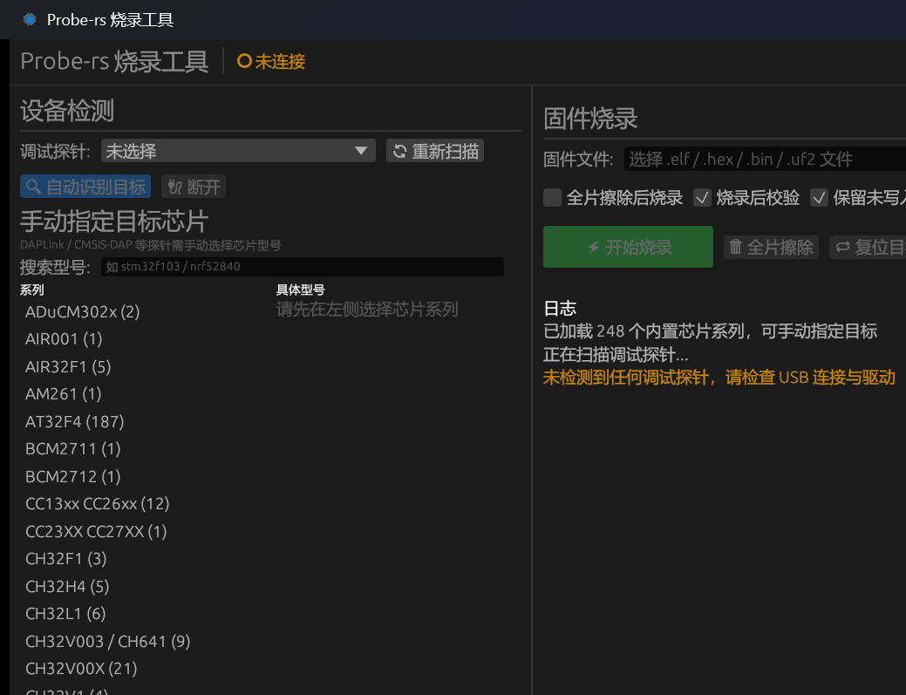

# Probe-rs 烧录工具

基于 [probe-rs](https://probe.rs/) 与 [egui](https://github.com/emilk/egui) 开发的嵌入式固件图形化烧录工具。

支持自动检测调试探针、识别目标芯片、手动指定芯片型号，以及一键烧录、全片擦除、复位等操作，无需记忆命令行参数。

> English docs: [README-en.md](README-en.md)

## 界面截图



## 功能特性

- 🔍 **探针自动扫描**：自动枚举已连接的调试探针（ST-Link、J-Link、DAPLink / CMSIS-DAP 等）。
- 🎯 **目标自动识别**：支持自动识别芯片型号（ST-Link / J-Link 等可自报型号的探针）。
- 🔌 **连接方式可选**：支持「正常连接」与「复位期间连接」（Under Reset），对应 STM32 BOOT0/BOOT1 启动配置，便于在目标程序干扰 SWD 或需从系统存储器启动时连接。
- 🧩 **手动指定芯片**：内置 probe-rs 全部芯片型号库，按品牌 → 系列 → 具体型号三级联动选择，支持关键字实时搜索（适用于 DAPLink / CMSIS-DAP 等无法自动识别的探针）。
- 📁 **固件自动定位**：选择项目文件夹后自动扫描常见构建产物（cargo `target/`、Keil `Objects/`、CubeIDE `Debug/`、CMake `build/` 等），自动选中最佳固件，多候选可下拉切换。
- ⚡ **固件烧录**：支持 `.elf` / `.axf` / `.hex` / `.bin` / `.uf2` 格式，并可识别无扩展名的 Rust ELF 编译产物。
- ⚙️ **可配置烧录选项**：全片擦除、烧录后校验、保留未写入字节、烧录后复位运行。
- 🗑️ **全片擦除 / 目标复位**：一键操作。
- 📊 **进度显示**：擦除、编程、校验等操作进度条实时更新；总大小未知的操作（如全片擦除）显示旋转指示。
- 📡 **RTT 日志监控**：默认关闭；启用后底部面板实时显示目标 RTT 上行通道输出（多通道自动标注），并支持向目标下行通道 0 发送数据（回车或按钮）。
- 🌐 **中英文界面**：自动加载 Windows、macOS 与 Linux 上可用的 CJK 系统字体，顶栏可切换中文 / English。
- 🖼️ **图形化图标**：操作按钮带图标，程序窗口使用芯片样式图标。

## 系统要求

- Windows / Linux / macOS
- Rust 1.97 或更高版本（构建时）
- 支持 SWD / JTAG 的调试探针（ST-Link、J-Link、DAPLink、CMSIS-DAP 等）

## 构建

```bash
cargo build --release
```

生成的可执行文件位于 `target/release/probe-rs-ui`（Windows 为 `probe-rs-ui.exe`），可直接双击运行。

### Linux / macOS 构建包

推送至 `master` 后，GitHub Actions 会自动生成 Linux x86_64、macOS Intel 和 macOS Apple Silicon 的 `.tar.gz` 包。构建完成后可在仓库的 [Actions](https://github.com/xian684/probe-rs-ui/actions/workflows/build-packages.yml) 页面下载对应运行的 artifacts。

## 使用方法

1. 连接调试探针与目标芯片，启动程序后自动扫描探针。
2. 点击 **自动识别目标**；若探针不支持自动识别（如 DAPLink），在左侧 **手动指定目标芯片** 中按品牌、系列选择具体型号后点击 **按型号连接**。
3. 选择固件文件，或点击 **选择项目文件夹...** 让程序自动定位编译产物。
4. 按需勾选烧录选项，点击 **开始烧录**。

## 依赖版本

| 依赖 | 版本 |
| ---- | ---- |
| eframe / egui | 0.31 |
| probe-rs | 0.32 |
| rfd | 0.17 |

## 项目结构

```
src/
├── main.rs    程序入口、窗口配置与图标
├── app.rs     egui 界面、事件处理与面板渲染
├── worker.rs  后台工作线程：探针扫描、连接、烧录、擦除、复位
├── chips.rs   内置芯片库枚举与品牌分组
├── firmware.rs 固件扫描与格式识别（ELF/HEX/BIN/UF2）
├── rtt.rs     RTT 会话生命周期与通道读写
├── fonts.rs   CJK 字体加载
└── i18n.rs    语言支持（中文 / English）
```

## 常见问题

**DAPLink 无法自动识别芯片？**
DAPLink / CMSIS-DAP 为通用调试协议，不向主机上报芯片型号，因此无法自动识别。请在左侧 **手动指定目标芯片** 中搜索并选择系列与具体型号后连接。

**找不到编译产物？**
点击 **选择项目文件夹...** 后，程序会递归扫描常见构建输出目录；若仍未找到，请确认固件为 `.elf` / `.hex` / `.bin` / `.uf2` 格式。
